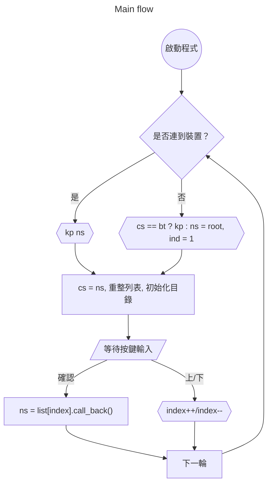

# 2025-Medical-System-Project

## Raspberry Pi Directory

```
Rpi/
├── audio/
│   ├── audioFiles/
│   │   ├── all/
│   │   ├── en/
│   │   ├── jp/
│   │   ├── tw/
│   │   ├── zh/
│   ├── __init__.py
│   ├── classes.py
│   ├── language_detection.py
│   ├── player.py
│   ├── recognizer.py
│   ├── recorder.py
├── bluetooth/
│   ├── __init__.py
│   ├── classes.py
│   ├── device_manager.py
├── data/
│   ├── __init__.py
│   ├── draw.py
│   ├── NotoSansCJK-Regular.ttc
│   ├── vision.py
├── rpi/
│   ├── models/
│   │   ├── __init__.py
│   │   ├── menus.py
│   │   ├── testers.py
│   ├── __init__.py
│   ├── interrupt.py
│   ├── menu.py
│   ├── resource.py
│   ├── tester.py
├── test/
│   ├── bunch of testing ...
├── config_manager.py
├── config.json
├── main.py (Program Entrance)
├── requirements.txt
├── setting.py
```

## Note

### Menu
|            | MENU_STATE_ROOT | MENU_STATE_BT | MENU_STATE_VOLUME |
|------------|-----------------|---------------|-------------------|
| no device  | root, ind=1     | bt, kp ind    | root, ind=1       |
| has device | root, kp ind    | bt, kp ind    | volume, kp ind    |

### Flow Charts

---


TODO 優化專案架構至下方樣式
```
Rpi/
├── src/                          # 將主要程式碼集中在 src 目錄下
│   ├── audio/                    # 音訊相關模組
│   │   ├── __init__.py
│   │   ├── models.py             # 將 classes.py 改名為 models.py，統一命名
│   │   ├── detection.py          # 將 language_detection.py 簡化命名
│   │   ├── player.py
│   │   ├── recognizer.py
│   │   ├── recorder.py
│   ├── bluetooth/                 # 藍牙相關模組
│   │   ├── __init__.py
│   │   ├── models.py             # 將 classes.py 改名為 models.py
│   │   ├── manager.py            # 將 device_manager.py 改名為 manager.py
│   ├── data/                     # 靜態資料與資源
│   │   ├── __init__.py
│   │   ├── draw.py
│   │   ├── vision.py
│   │   ├── NotoSansCJK-Regular.ttc
│   ├── hardwares/                # 樹莓派硬體相關模組
│   │   ├── __init__.py
│   │   ├── motor.py
│   │   ├── oled.py
│   │   ├── sonic.py
│   │   ├── button.py
│   ├── rpi/                      # 樹莓派軟體相關模組
│   │   ├── __init__.py
│   │   ├── models/               # 將 models 目錄保留
│   │   │   ├── __init__.py
│   │   │   ├── menus.py
│   │   │   ├── testers.py
│   │   ├── interrupt.py
│   │   ├── menu.py
│   │   ├── resource.py
│   │   ├── tester.py
│   ├── config/                    # 配置相關模組
│   │   ├── __init__.py
│   │   ├── manager.py            # 將 config_manager.py 改名為 manager.py
│   ├── assets/                   # 靜態資源（音訊檔案等）
│   │   ├── audio/                # 將 audioFiles 改名為 audio
│   │   │   ├── all/
│   │   │   ├── en/
│   │   │   ├── jp/
│   │   │   ├── tw/
│   │   │   ├── zh/
│   ├── main.py                   # 程式入口
├── tests/                        # 測試目錄（將 test 改名為 tests，遵循慣例）
│   ├── unit/                     # 單元測試
│   ├── integration/              # 整合測試
│   ├── __init__.py
├── config.json                   # 配置檔案保留在根目錄
├── requirements.txt              # 依賴清單
├── settings.py                   # 將 setting.py 改名為 settings.py（複數形式更符合慣例）
├── README.md                     # 新增專案說明文件
├── LICENSE                       # 新增授權文件
├── .gitignore                    # 新增 Git 忽略文件
```