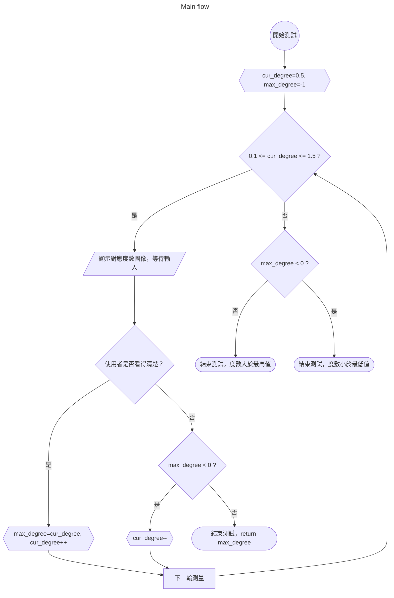

# 2025-Medical-System-Project

## Directory

- data
  - rpi
    - draw.py
    - vision

## Flow Chart

```mermaid
---
title: Main flow
---
flowchart TD
    set0((開始測試))
    set1{{cur_degree=0.5, max_degree=-1}}
    act0{0.1 <= cur_degree <= 1.5 ?}
    end1{max_degree < 0 ?}
    act1[/顯示對應度數圖像，等待輸入/]
    act2{使用者是否看得清楚？}
    act3{{max_degree=cur_degree, cur_degree++}}
    act4{max_degree < 0 ?}
    act5{{cur_degree--}}
    end2([結束測試，度數大於最高值])
    end3([結束測試，度數小於最低值])
    end4([結束測試，return max_degree])
    iter[下一輪測量]
    act3 --> iter
    set0 --> set1
    set1 --> act0
    act0 -- 否 --> end1
    end1 -- 否 --> end2
    end1 -- 是 --> end3
    act0 -- 是 --> act1
    act1 --> act2
    act2 -- 否 --> act4
    act2 -- 是 --> act3
    act4 -- 否 --> end4
    act4 -- 是 --> act5
    act5 --> iter
    iter --> act0
```