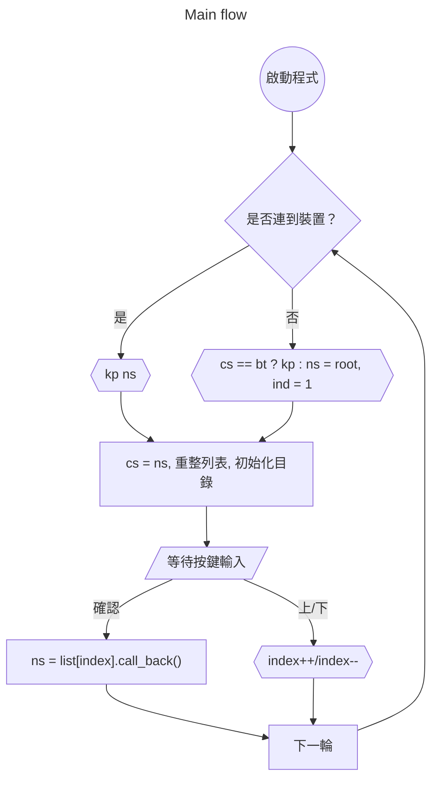
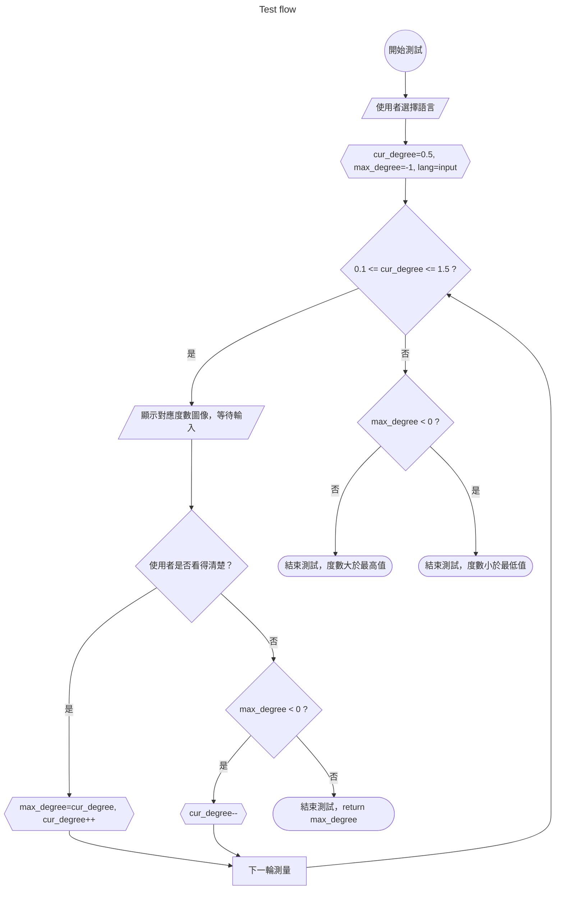

# 2025-Medical-System-Project

## Directory

- Rpi
  - audio
    - classes.py
    - language_detection.py
    - player.py
    - recognizer.py
    - recorder.py
  - data
    - draw.py
    - vision.py
  - rpi
    - interrupt.py
    - models
      - Menus.py
      - Testers.py
    - resource.py
    - tester.py
  - test
    - bunch of testing ...
  - setting.py

## Note

### Menu
|            | MENU_STATE_ROOT | MENU_STATE_BT | MENU_STATE_VOLUME |
|------------|-----------------|---------------|-------------------|
| no device  | root, ind=1     | bt, kp ind    | root, ind=1       |
| has device | root, kp ind    | bt, kp ind    | volume, kp ind    |

### Flow Charts

---
